### To Create a Virtual Environment Run these commands in the linux shell
1. `python3 -m venv venv`

### To Activate the virtual environment
2. `source venv/bin/activate`

### To install the required dependencies
3. `pip install -r requirements/requirements.txt`


---
## To create a virtual machine in GCP:
1. Go to [GCP Console](https://console.cloud.google.com/)
2. Click on the hamburger menu on the left
3. Go to compute engine -> VM Instances
4. Click on create instance at the top
5. Select the configuration of the machine that you want. GPUs are not available in free trial. So, if you are on free trial please don't choose GPUs.
6. Click on Create at the bottom of the page
7. Wait for a few minutes so that the instance will be created

---
## To run the virtual machine
1. Go to [GCP Console](https://console.cloud.google.com/)
2. Click on the hamburger menu on the left
3. Go to compute engine -> VM Instances
4. You will see the VM instance that you have created in the previous step
5. Select that VM and click on start/resume at the top
6. Wait for the machine to boot up
7. Once the machine is booted up, under connect there will be SSH option. Click on that SSH option
8. A new window will open. Wait for a few seconds and you will see the linux shell for the Virtual machine
9. Now you can start doing your work on the VM

---
## How to create buckets and folders in cloud storage?
1. Go to [GCP Console](https://console.cloud.google.com/)
2. Click on the hamburger menu on the left
3. Go to Cloud Storage -> Buckets
4. Click on create at the top
5. Name your bucket as **data-lake-bucket-climate-modelling**, choose **us(multi regions)** as location, location type **multi region**, storage class **standard**. Leave everything else to default and click create.
6. You will see your bucket in cloud storage -> buckets
7. Click on the bucket
8. Click create folder on the top
9. Give the folder name as **daylength** and click on create
10. Follow the steps 8 and 9 to create other folders called: **maximumtemperature**, **minimumtemperature**, **shortwaveradiation**, and **snowwaterequivalent**
11. Your Bucket and the folders inside these buckets are now created.
12. The important thing to remember is that these bucketnames will be used in our code. So, if you want to change these names, then change the names in the code as well.

---
## How to load data into cloud storage buckets?
1. To load the files for a specific value like tmin, tmax etc... run the corresponding files located in `load_nc_files_to_data_lake`
2. To Download all the files run `download_all_files.sh` located in `load_nc_files_to_data_lake`

---
## How to create tables in bigquery?
1. To create empty tables run the corresponding files in `create_empty_tables_with_schemas`
2. If you want to change the schema of any of the tables please refer to this code and modify it here.
3. To see if tables were created successfully go to cloud console -> Bigquery. Then at the side panel find your datset and the tables that were created when you ran these scripts.

---
## How to insert dates into the tables created above?
1. Run the corresponding files located at `insert_rows_with_only_dates_in_tables/` to insert the date values into the bigquery table.
2. You can check that the values are inserted using the bigquery UI available on google cloud console.

---
## How to insert the x,y and the measured values into the above tables?
1. Please wait for 30 to minutes because once you insert rows into the table bigquery doesn't support updates or deletes to that rows for sometime. So, please wait for a few minutes and start running the scripts located at `insert_x_y_climate_values_into_tables`.
2. Run the script
3. Check that the values are being updated in the bigquery UI console.

---
## SQL Queries that can be useful when running bigquery
```
### Create a new empty table with the schema of the old table. Testing_table_3 is the new table and will have the same schema as testing_table_2
CREATE TABLE `climate-data-modeling.python_creating_dataset.testing_table_3`
AS
SELECT *
FROM `climate-data-modeling.python_creating_dataset.testing_table_2`
WHERE 1 = 0;

## Delete a table
DROP TABLE `climate-data-modeling.python_creating_dataset.testing_table_3_16` 

## See the schema of a table
SELECT
  column_name,
  data_type
FROM
  `climate-data-modeling.python_creating_dataset.INFORMATION_SCHEMA.COLUMNS`
WHERE
  table_name = 'testing_table_3'
ORDER BY
  ordinal_position;


## See the values of a table
SELECT * FROM `climate-data-modeling.climate_data.daylength` LIMIT 1000

## See the length of the nested and repeated fields. Here dayls is a Struct of repeated values
SELECT ARRAY_LENGTH(dayls) AS num_values
FROM `climate-data-modeling.climate_data.daylength_data`

## Insert the values into the table manually.
UPDATE `climate-data-modeling.python_creating_dataset.testing_table_3`
                                SET dayls = ARRAY_CONCAT(dayls, [STRUCT(-100.0 AS x, -100.0 AS y, 300.00 AS dayl)])
                                WHERE date = '1997-01-01T12:00:00'

## These queries can be modified as per the requirement when you are testing.
```
---
## Images showing number of values inserted into the table when the script is running
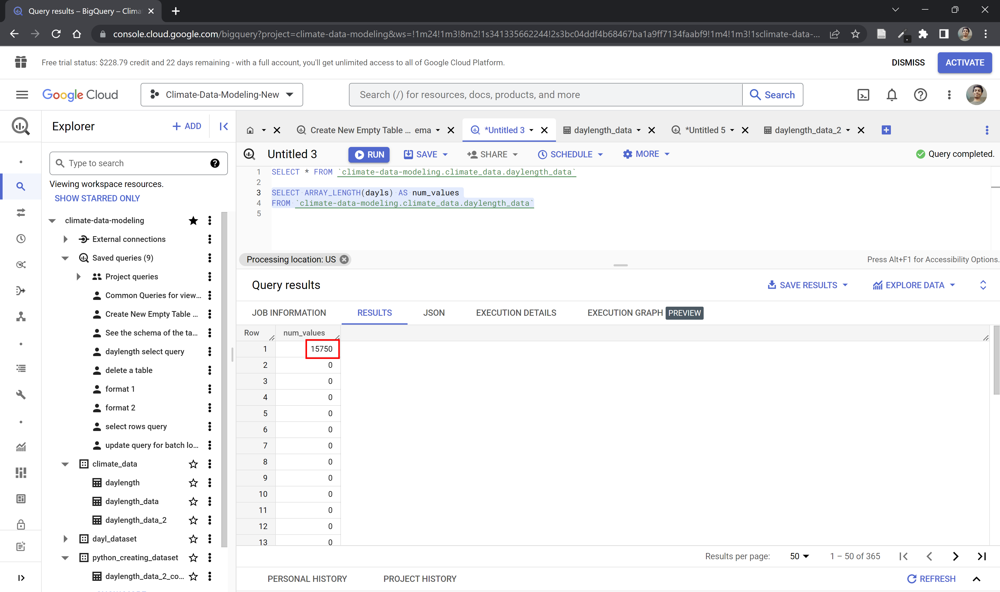
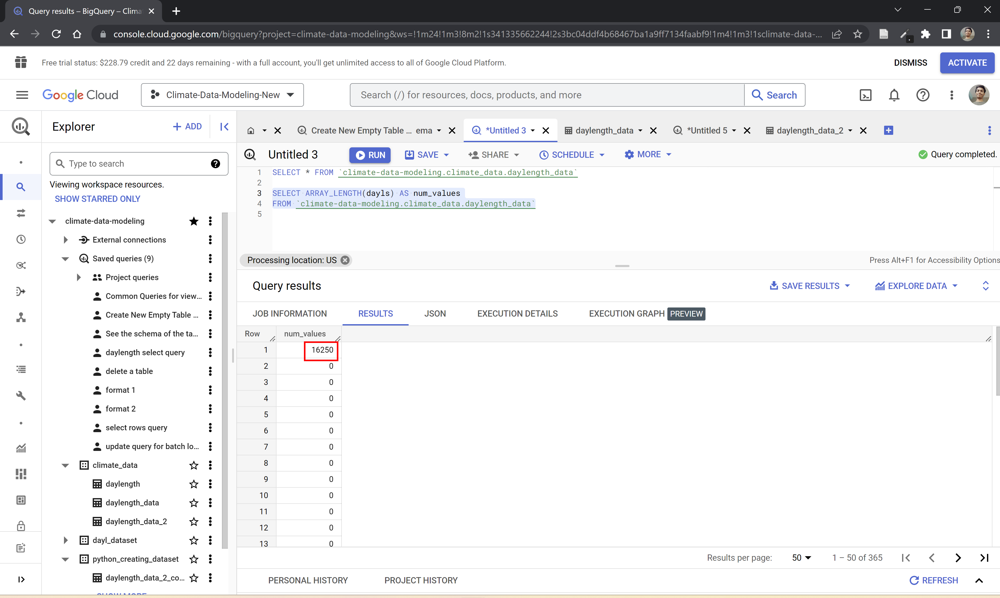


---
## Images to see the inserted values
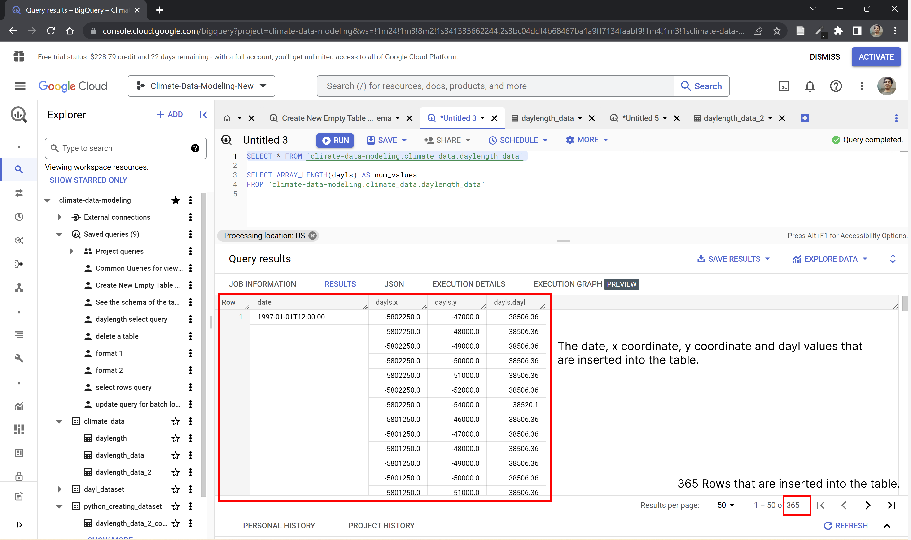
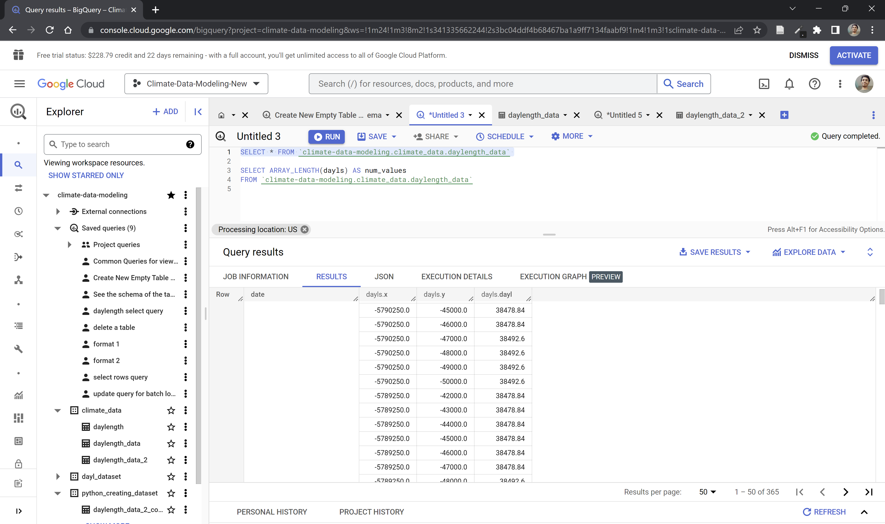


---
## Images to run the script and see the output result of tables being created
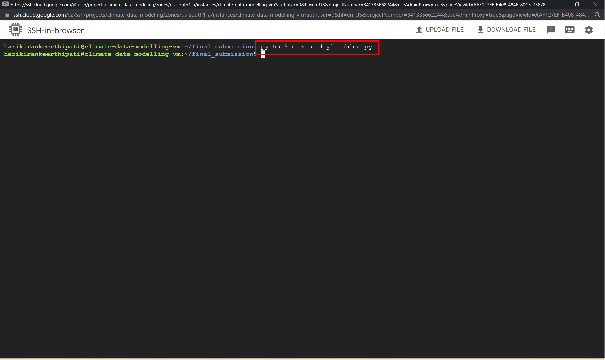 


---
## Images to see the created tables
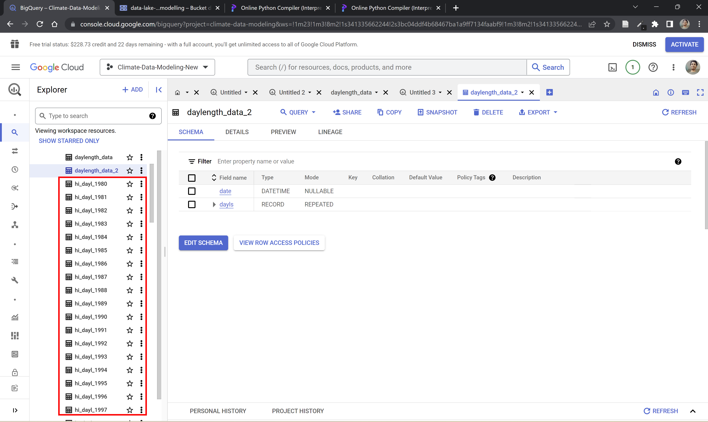
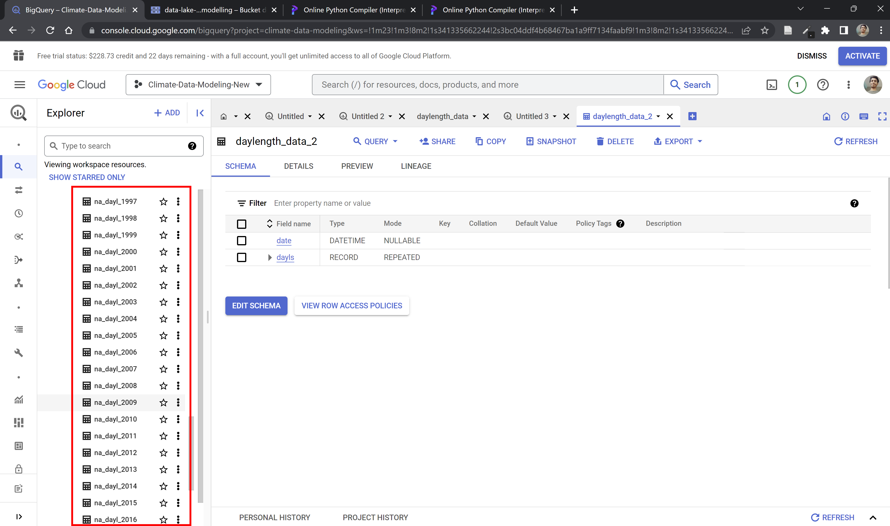


---
## Images showing the progress of the values of being inserted
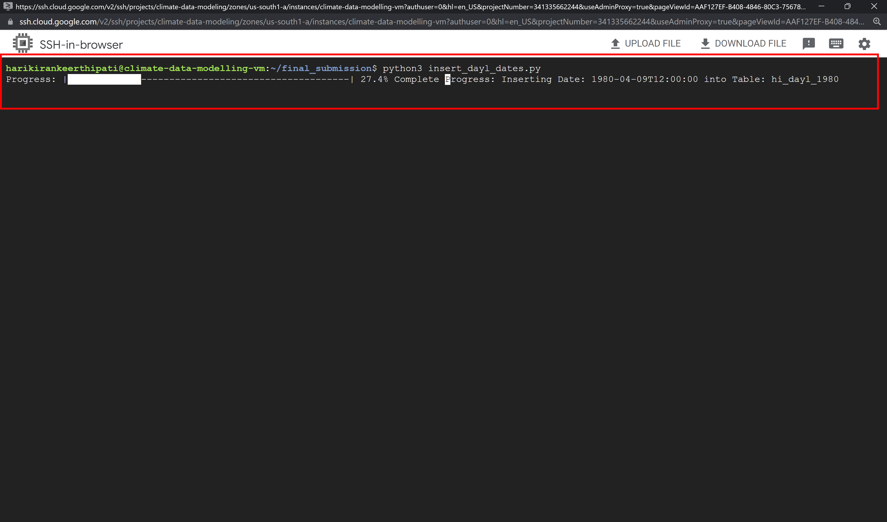
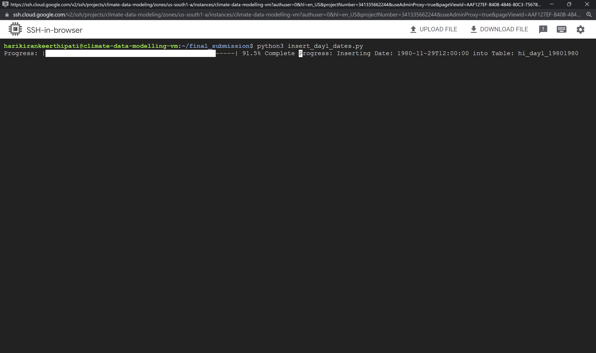


---
## Images showing the dates inserted to the tables
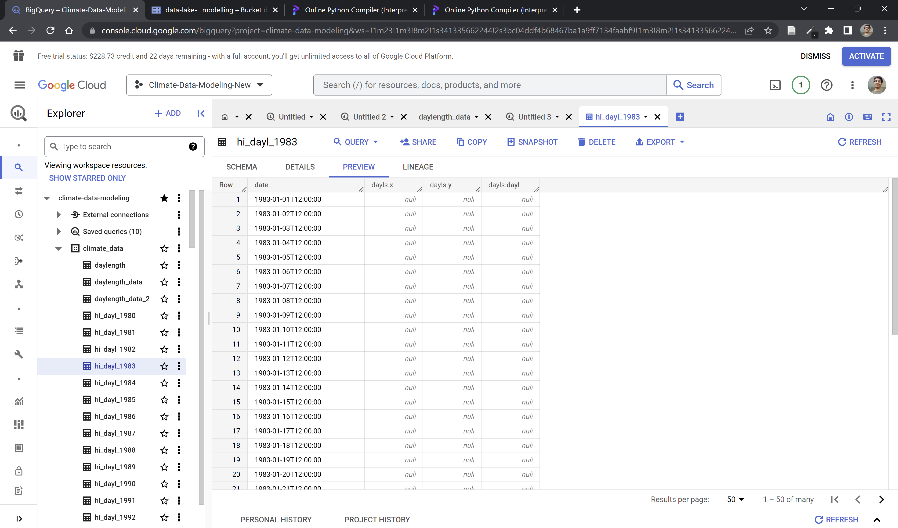
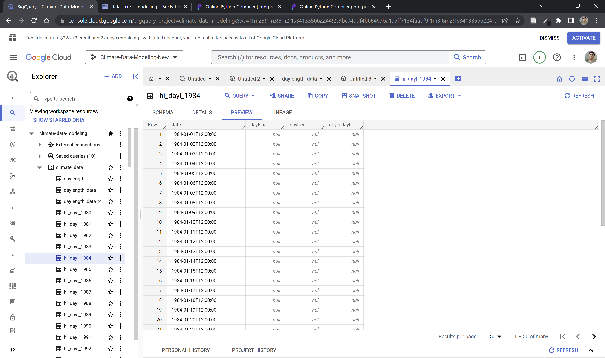


---
## Images showing the progress of batch inserts in the tables. Please don't give high batch sizes since the size of the request that you can send is limited. So, if the size of the batch is too high then you will get errors.
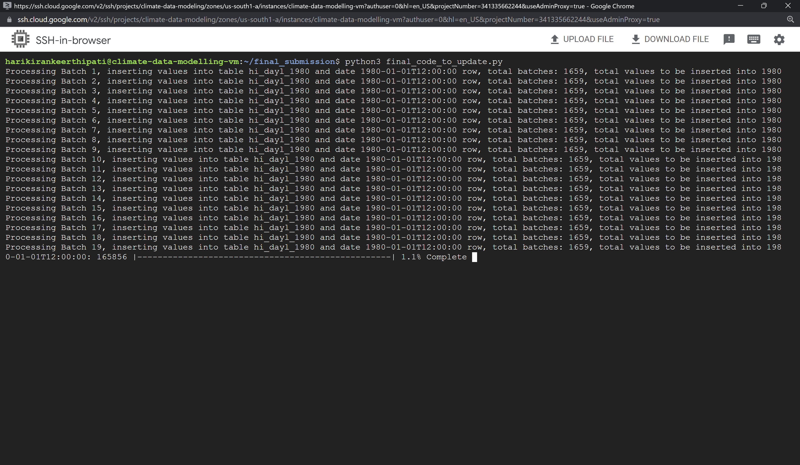
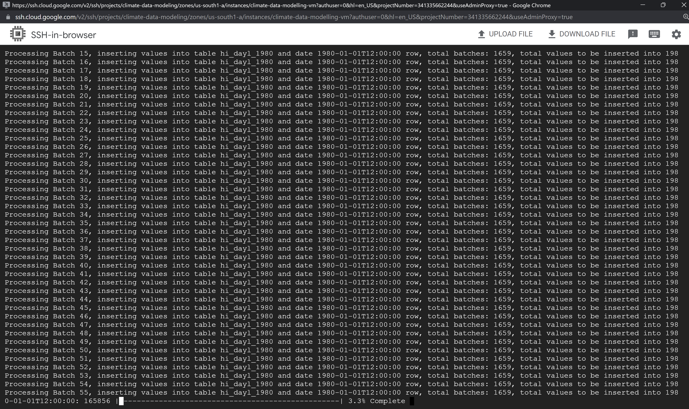
